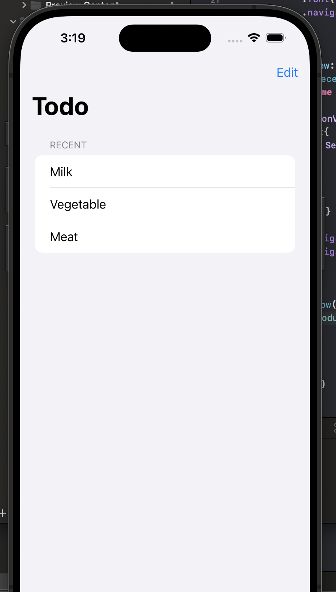

# Swift List with deletion

```
NavigationView {
            List{
                Section("Recent") {
                    ForEach(recentProducts, id : \.self) { recentProducts in
                        Text(recentProducts.title)
                    }
                    .onDelete(perform: deleteRow)
                }
            }
            .navigationTitle("Todo")
            .navigationBarItems(trailing: EditButton())
        }
```
<center>

</center>


